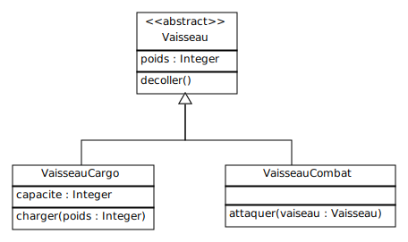

## Modéliser des classes avec USE-OCL

USE-OCL utilise une syntaxe particulière pour définir le modèle à vérifier.

Chaque fichier de modèle doit commencer par la définition `model <modelname>`:

	model Animaux

Pour définir une classe on utilise la directive `class <classname>` et on termine par `end`.

	class Animal
	end

Une classe possède un nom et eventuellement des attributs et des opérations.

Les attributs sont déclarés grâce à la directive `attributes` suivie des attributs typés:

	class Canard
		attributes
			nom: String
	end

Les méthodes sont déclarées grâce à la directive `operations` suivie des signatures des méthodes:

	class Canard
		attributes
			nom: String
		operations
			cancaner(i: Integer): String
	end

### Exercice

Dans cet exercice et les suivants, nous allons modéliser un jeu de vaisseaux spaciaux appelé `SpaceZ`.

Reproduisez le modèle représenté ci-dessous en respectant la syntaxe de USE-OCL.

