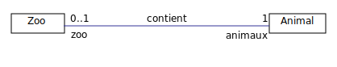

## Modéliser des associations

Les associations permettent de définir des relations sémantiques entre des classes.

Pour définir des associations dans USE, on utilise la construction `association`:

	association contient between
		Zoo [0..1] role zoo
		Car [*] role animaux
	end

### Exercice

Reproduisez le modèle représenté ci-dessous en respectant la syntaxe de USE-OCL.

